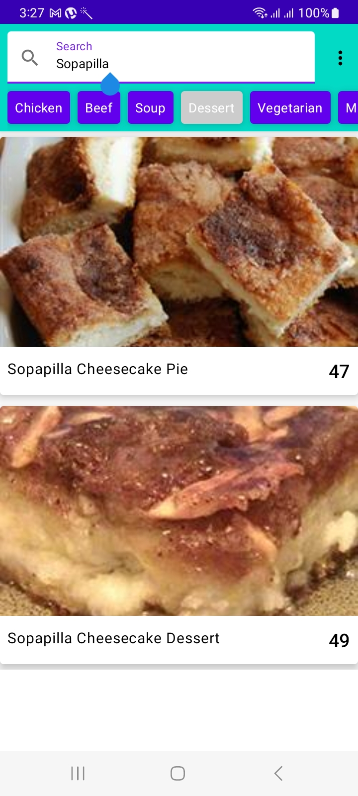
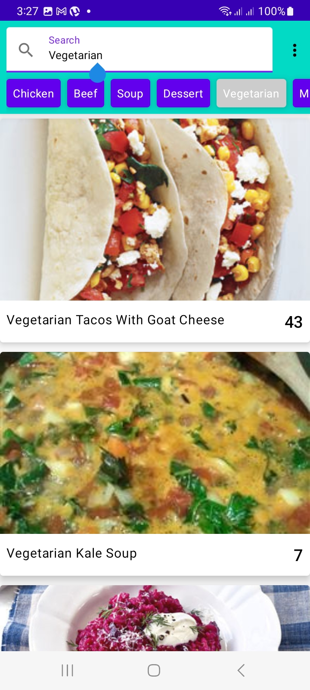
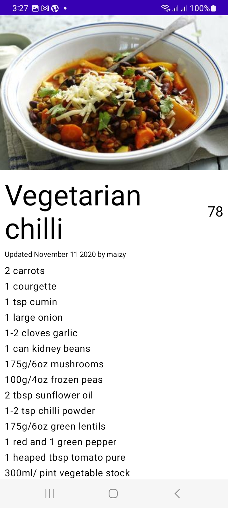

# What is this project?
This is Jet pack compose project

# Main Features
1. Kotlin
1. MVVM
1. Jetpack Compose
1. MutableState
	- Simpler than LiveData or Flow with respect to composables.
1. Hilt
1. Navigation Components
1. Retrofit2
1. Single Activity Architecture
1. App Themes
1. Custom Fonts

# Compose features
1. Snackbars
2. Theming
3. Fonts
4. Colors
6. ConstraintLayout
7. Rows
9. Columns
10. Scaffold
11. AppBar
12. Circular Progress Indicator

# References

1. https://developer.android.com/jetpack/compose
1. https://developer.android.com/jetpack/compose/state
1. Color system
	- https://material.io/design/color/the-color-system.html

